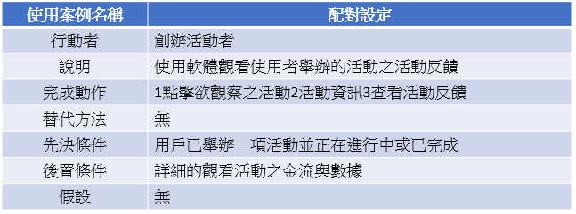

# 2020_OO

## 姓名:魏晸哲 學號:C107118131 班級:資管3甲

### 小組成員: 魏晸哲(組長) 王信棟 李慶毅 周晊浩

### 專題名稱:Fiesta

### 內容:活動社群平台

## 專題由來

#### 有鑑於現今的社群網路已相當成熟，且各社群平台所建立的人際關係多數存在於虛擬的網際網路中，導致人與人之間的相處少了溫度；目前市面上活動籌備資訊整合平台的活動主辦方大多為針對商業化中大型活動，且活動規劃細節繁瑣、平台功能較少有整合社群功能，不利於小型組織及個人舉辦活動。故本團隊以Swift、Kotlin、Python等工具來開發名為「Fiesta」的O2O社群網路 × 活動籌備資訊整合平台，透過平台中的多項功能讓各規模活動主辦方在組織活動時更為輕鬆，並使用機器學習之技術根據使用者之行為數據，將活動資訊精準投放至使用者，同時降低各類型組織及個人舉辦活動時的時間成本及金錢成本，進而提升人與人現實中的互動及更加緊密連結社會。

## 專題內容
#### Fiesta提供使用者兩大服務，一為舉辦活動，二為參加活動。使用者可以創立各式各樣的活動，其活動定義之範圍甚大，小則可以是個人出遊、同好會、聚餐等小規模活動，我們提供基本活動模組讓使用者辦起活動更加快速且便利，大則可以舉辦大型音樂祭、售票活動、公益活動以及各種不同領域相關的聚會我們也提供進階活動模組對活動的每個細節提供最好的解決方案，並且針對財務、合作商家、使用者體驗及地點選擇等方面開設專屬模組，讓活動主辦方省去更多不必要的時間及費用，Fiesta提供以上6大功能模組降低活動創辦門檻、減少金錢開銷與時間成本，並將活動資訊整合，能使人們能更輕鬆參與現實社群中的互動。使用者亦可參加各式各樣的活動，本平台利用AI推薦使用者參加過的活動主辦方舉辦的新活動或是有興趣的活動，提升活動主辦方之廣宣效益，並降低搜尋活動的時間，提升參與活動的意願，增加活動的需求，提升社會舉辦活動的風氣。

## 工作分配

#### 後端開發:王信棟、李慶毅
#### 內容發想、前端設計、ppt及書面製作:魏晸哲、周晊浩

## 甘特圖

## 功能性需求
#### 一般活動模組：從創建活動、設定活動細項、活動推廣到活動結束後的使用者回饋，Fiesta有效降低活動舉辦成本並提升效率。
#### 財務資訊模組：活動主辦方輸入各項成本或營收金額範圍，財務資訊模組將推算此活動每個參加者之攤銷金額;還能將各項財務相關報表上傳，此模組AI將推算下一次的活動成本。
#### 進階活動模組：進一步提供統計人數、人員分配、活動排程、電子票據、活動即時資訊、線上抽獎即公佈通知。
#### 使用者體驗模組：提供整體活動評分機制、各節目評分機制、並將後台統計數據呈現給活動主辦方，並提升使用者回饋比例。
#### 地點推薦模組：依照使用者及Google Map地點評分並根據活動方條件呈現地點推薦排行，並提供平均花費及提供性價比最高之場地。
#### 廠商推薦模組：依照使用者評分並根據活動方條件推薦場佈廠商、活動策劃排行，並告知活動主辦方此廠商的平均收費及提供性價比最高且符合活動要求之廠商選擇。
## 非功能性需求
#### 導入演算法、人工智慧，精準辨識使用者需求
#### 資料處理優化讓程式運算更快速
#### UI/UX整合設計讓介面看起來更簡約、直覺
#### 穩定的系統
#### 使用的流暢度
#### 易上手的操作、直覺性介面
#### 簡單明瞭的功能提示  
#### 適合各使用者的人工智慧  
#### 可簡易擴充性功能  
#### 系統管理者方便管理
## 功能分解圖(FDD)

## 需求分析
#### 1. 參加活動者可以使用此軟體參加合適的活動
#### 2. 舉辦活動者可以使用此軟體舉辦合適的活動
#### 3. 透過人工智慧協助使用者尋找適合的需求
#### 4. 提供電子票據功能加速現場流程節省紙本票具成本
#### 5. 參加活動後獲取一系列活動數據，觀看活動細節
### 參加活動：
#### 用戶可以藉此軟體設定自己喜愛的活動
#### AI分析用戶喜好推薦適合的活動
#### 藉由評分系統讓用戶更了解活動主辦方品質
#### 提供電子化票據
### 主辦活動方：
#### 後台數據整合，活動金流透明、客戶反應蒐集
#### 加入電子化票據功能減少紙本票據的成本
#### 主辦活動商家推薦系統
## 使用案例圖

## 使用案例與其循序圖和活動圖

## 系統環境圖

## DFD圖0程序

## UML類別圖

## 分鏡圖
## 步驟說明

## 實體關係圖

